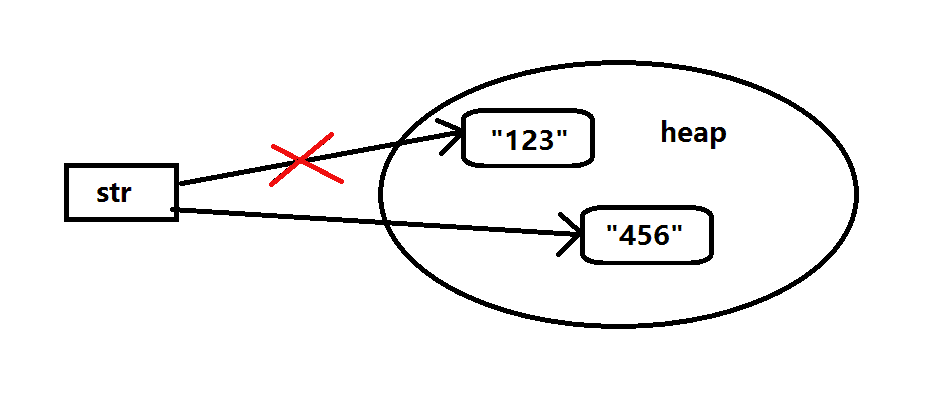

# [String 为什么不可变](http://sunluyao.com/2017/09/28/why-string-final.html)

众所周知, `String` 是一个不可变的，由 `final` 修饰的类。那么它的不可变性体现在哪里呢? 看下面一段简单的代码：

```java
String str= "123";
str = "456";
```

相信应该没人会觉得这段代码是错误的，那么这符合 `String` 的不可变性吗？`String` 的不可变性是如何体现的？ 不可变性的好处是什么？带着这些疑问，read the fuck source code !

## 什么是不可变类 ？

`Effective Java` 中第 15 条 `使可变性最小化` 中对 `不可变类` 的解释：

::: tip
不可变类只是其实例不能被修改的类。每个实例中包含的所有信息都必须在创建该实例的时候就提供，并且在对象的整个生命周期内固定不变。为了使类不可变，要遵循下面五条规则：

1. 不要提供任何会修改对象状态的方法。
2. 保证类不会被扩展。 一般的做法是让这个类称为 `final` 的，防止子类化，破坏该类的不可变行为。
3. 使所有的域都是 final 的。
4. 使所有的域都成为私有的。 防止客户端获得访问被域引用的可变对象的权限，并防止客户端直接修改这些对象。
5. 确保对于任何可变性组件的互斥访问。 如果类具有指向可变对象的域，则必须确保该类的客户端无法获得指向这些对象的引用。
:::

在 Java 平台类库中，包含许多不可变类，例如 String , 基本类型的包装类，BigInteger, BigDecimal 等等。综上所述，不可变类具有一些显著的通用特征：类本身是 final 修饰的；所有的域几乎都是私有 `final` 的；不会对外暴露可以修改对象属性的方法。通过查阅 `String` 的源码，可以清晰的看到这些特征。

## String 的源码实现

回到开头提出的问题，对于这段代码：

```
String str= "123";
str = "456";
```

下面这张图清楚地解释了代码的执行过程：



执行第一行代码时，在堆上新建一个对象实例 `123` ,`str` 是一个指向该实例的引用，引用包含的仅仅只是实例在堆上的内存地址而已。执行第二行代码时，仅仅只是改变了 `str` 这个引用的地址，指向了另一个实例 `456`。所以，正如前面所说过的，**不可变类只是其实例不能被修改的类。** 给 `str` 重新赋值仅仅只是改变了它的引用而已，并不会真正去改变它本来的内存地址上的值。这样的好处也是显而易见的，最简单的当存在多个 `String` 的引用指向同一个内存地址时，改变其中一个引用的值并不会对其他引用的值造成影响。当然还有其他的一些好处，这个放在后面再总结。

那么，`String` 是如何保持不可变性的呢？结合 `Effective Java` 中总结的五条原则，阅读它的 [源码](http://grepcode.com/file/repository.grepcode.com/java/root/jdk/openjdk/8-b132/java/lang/String.java?av=f) 之后就一清二楚了。

看一下 `String` 的几个域：

```java
public final class String
    implements java.io.Serializable, Comparable<String>, CharSequence {
    /** The value is used for character storage. */
    private final char value[];

    /** Cache the hash code for the string */
    private int hash; // Default to 0

    /** use serialVersionUID from JDK 1.0.2 for interoperability */
    private static final long serialVersionUID = -6849794470754667710L;

    /**
     * Class String is special cased within the Serialization Stream Protocol.
     *
     * A String instance is written into an ObjectOutputStream according to
     * <a href="{@docRoot}/../platform/serialization/spec/output.html">
     * Object Serialization Specification, Section 6.2, "Stream Elements"</a>
     */
    private static final ObjectStreamField[] serialPersistentFields =
        new ObjectStreamField[0];

        ...
        ...
}

```
`String` 类是 `final` 修饰的，满足第二条原则：`保证类不会被扩展。` 分析一下它的几个域：

* `private final char value[] :` 可以看到 Java 还是使用字节数组来实现字符串的，并且用 `final` 修饰，保证其不可变性。这就是为什么 String 实例不可变的原因。
* `private int hash :` String的哈希值缓存
* `private static final long serialVersionUID = -6849794470754667710L ：` String对象的 `serialVersionUID`
* `private static final ObjectStreamField[] serialPersistentFields = new ObjectStreamField[0] ：` 序列化时使用

其中最主要的域就是 `value`，代表了 String对象的值。由于使用了 `private final` 修饰，正常情况下外界没有办法去修改它的值的。正如第三条 **使所有的域都是 final 的。** 和第四条 **使所有的域都成为私有的** 所描述的。难道这样一个 `private` 加上 `final` 就可以保证万无一失了吗？看下面代码示例：

```java
final char[] value = {'a', 'b', 'c'};
value[2] = 'd';
```
这时候的 `value` 对象在内存中已经是 `a b d` 了。其实 `final` 修饰的仅仅只是 `value` 这个引用，你无法再将 `value` 指向其他内存地址，例如下面这段代码就是无法通过编译的：

```java
final char[] value = {'a', 'b', 'c'};
value
```

所以仅仅通过一个 `final` 是无法保证其值不变的，如果类本身提供方法修改实例值，那就没有办法保证不变性了。Effective Java 中的第一条原则 **不要提供任何会修改对象状态的方法** 。String 类也很好的做到了这一点。在 `String` 中有许多对字符串进行操作的函数，例如 `substring` `concat``replace` `replaceAll` 等等，这些函数是否会修改类中的 `value` 域呢？我们看一下 `concat()` 函数的内部实现：

```java
public String concat(String str) {
    int otherLen = str.length();
    if (otherLen == 0) {
        return this;
    }
    int len = value.length;
    char buf[] = Arrays.copyOf(value, len + otherLen);
    str.getChars(buf, len);
    return new String(buf, true);
}
```

注意其中的每一步实现都不会对 `value`产生任何影响。首先使用 `Arrays.copyOf()` 方法来获得 `value` 的拷贝，最后重新 `new` 一个String对象作为返回值。其他的方法和 `contact` 一样，都采取类似的方法来保证不会对 `value` 造成变化。的的确确，`String` 类中并没有提供任何可以改变其值的方法。相比 `final` 而言，这更能保障 String 不可变。

## String 对象在内存中的位置

关于 Java 内存区域的相关知识可以阅读 `《深入理解 Java 虚拟机》` 一书中相关章节或者我的对应的 [读书笔记](http://sunluyao.com/learning-note/2017/09/07/java-runtime-area/)。

细心的读者应该发现上面出现过两种 String 对象的写法：

```java
String str1 = "123";
String str2 = new String("123");
System.out.println(str1 == str2);
```

结果显然是 `false`。我们都知道字符串常量池的概念，JVM 为了字符串的复用，减少字符串对象的重复创建，特别维护了一个字符串常量池。第一种字面量形式的写法，会直接在字符串常量池中查找是否存在值 `123`，若存在直接返回这个值的引用，若不存在创建一个值为 `123` 的 String 对象并存入字符串常量池中。而使用 `new` 关键字，则会直接在堆上生成一个新的 String 对象，并不会理会常量池中是否有这个值。所以本质上 `str1` 和 `str2` 指向的内存地址是不一样的。

那么，使用 `new` 关键字生成的 String 对象可以进入字符串常量池吗？答案是肯定的，String 类提供了一个 native 方法 `intern()` 用来将这个对象加入字符串常量池：

```java
String str1 = "123";
String str2 = new String("123");
str2=str2.intern();
System.out.println(str1 == str2);
```

打印结果为 `true`。`str2` 调用 `intern()` 函数后，首先在字符串常量池中寻找是否存在值为 `123` 的对象，若存在直接返回该对象的引用，若不存在，加入 `str2` 并返回。上述代码中，常量池中已经存在值为 `123` 的 `str1` 对象，则直接返回 `str1` 的引用地址，使得 `str1` 和 `str2` 指向同一个内存地址。

那么说了半天的字符串常量池在内存中处于什么位置呢？常量池是方法区的一部分，用于存放编译期生成的各种字面量和符号引用，运行期间也有可能将新的常量放入池中。在 Java 虚拟机规范中把方法区描述为堆的一个逻辑部分，但它却有一个别名叫 `Non-Heap`，目的应该是为了和 Java 堆区分开。

## 不可变类的好处

`Effective Java` 中总结了不可变类的特点。

* **不可变类比较简单。**
* **不可变对象本质上是线程安全的，它们不要求同步。不可变对象可以被自由地共享。**
* **不仅可以共享不可变对象，甚至可以共享它们的内部信息。**
* **不可变对象为其他对象提供了大量的构建。**
* **不可变类真正唯一的缺点是，对于每个不同的值都需要一个单独的对象。**

综上所述，`String` 的确是个不可变类，但是真的没有办法改变 String 对象的值吗？答案肯定是否定的，反射机制可以做到很多平常做不到的事情。

```java
String str = "123";
System.out.println(str);
Field field = String.class.getDeclaredField("value");
field.setAccessible(true);
char[] value = (char[]) field.get(str);
value[1] = '3';
```

执行结果：

```
123
133
```

很显然，通过反射可以破坏 `String` 的不可变性。

## 总结

除了 String 类，系统类库中还提供了一些其他的不可变类，基本类型的包装类、BigInteger、BigDecimal等等。这些不可变类比可变类更加易于设计、实现和使用，不容易出错且更加安全。另外，要记住并不仅仅是靠一个 `final` 关键字来实现不可变的，更多的是靠类内部的具体实现细节。