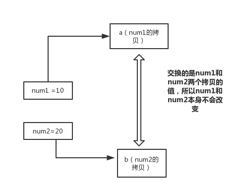
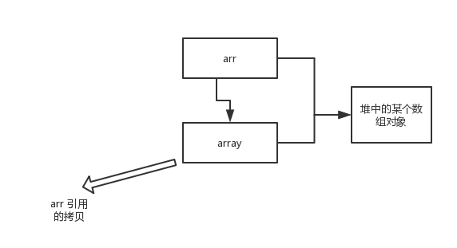
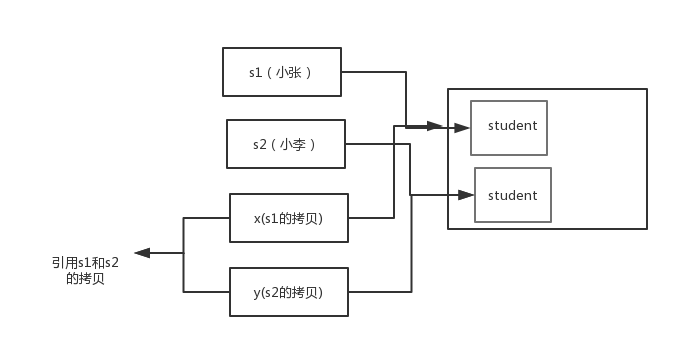
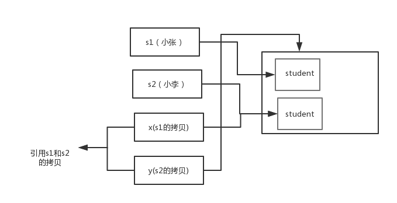

# 为什么 Java 中只有值传递


首先回顾一下在程序设计语言中有关将参数传递给方法（或函数）的一些专业术语.**按值调用(call by value)表示方法接收的是调用者提供的值, 而按引用调用（call by reference)表示方法接收的是调用者提供的变量地址.一个方法可以修改传递引用所对应的变量值, 而不能修改传递值调用所对应的变量值.**  它用来描述各种程序设计语言（不只是Java)中方法参数传递方式.

**Java程序设计语言总是采用按值调用.也就是说, 方法得到的是所有参数值的一个拷贝, 也就是说, 方法不能修改传递给它的任何参数变量的内容.**

**下面通过 3 个例子来给大家说明**

## example 1 


```java
public static void main(String[] args) {
    int num1 = 10;
    int num2 = 20;

    swap(num1, num2);

    System.out.println("num1 = " + num1);
    System.out.println("num2 = " + num2);
}

public static void swap(int a, int b) {
    int temp = a;
    a = b;
    b = temp;

    System.out.println("a = " + a);
    System.out.println("b = " + b);
}
```

**结果:**

```
a = 20
b = 10
num1 = 10
num2 = 20
```

**解析:**



在swap方法中, a、b的值进行交换, 并不会影响到 num1、num2.因为, a、b中的值, 只是从 num1、num2 的复制过来的.也就是说, a、b相当于num1、num2 的副本, 副本的内容无论怎么修改, 都不会影响到原件本身.

**通过上面例子, 我们已经知道了一个方法不能修改一个基本数据类型的参数, 而对象引用作为参数就不一样, 请看 example2.**


## example 2

```java
	public static void main(String[] args) {
		int[] arr = { 1, 2, 3, 4, 5 };
		System.out.println(arr[0]);
		change(arr);
		System.out.println(arr[0]);
	}

	public static void change(int[] array) {
		// 将数组的第一个元素变为0
		array[0] = 0;
	}
```

**结果:**

```
1
0
```

**解析:**



array 被初始化 arr 的拷贝也就是一个对象的引用, 也就是说 array 和 arr 指向的时同一个数组对象. 因此, 外部对引用对象的改变会反映到所对应的对象上.


**通过 example2 我们已经看到, 实现一个改变对象参数状态的方法并不是一件难事.理由很简单, 方法得到的是对象引用的拷贝, 对象引用及其他的拷贝同时引用同一个对象.**

**很多程序设计语言（特别是, C++和Pascal)提供了两种参数传递的方式:值调用和引用调用.有些程序员（甚至本书的作者）认为Java程序设计语言对对象采用的是引用调用, 实际上, 这种理解是不对的.由于这种误解具有一定的普遍性, 所以下面给出一个反例来详细地阐述一下这个问题.**


## example 3

```java
public class Test {

	public static void main(String[] args) {
		// TODO Auto-generated method stub
		Student s1 = new Student("小张");
		Student s2 = new Student("小李");
		Test.swap(s1, s2);
		System.out.println("s1:" + s1.getName());
		System.out.println("s2:" + s2.getName());
	}

	public static void swap(Student x, Student y) {
		Student temp = x;
		x = y;
		y = temp;
		System.out.println("x:" + x.getName());
		System.out.println("y:" + y.getName());
	}
}
```

**结果:**

```
x:小李
y:小张
s1:小张
s2:小李
```

**解析:**

交换之前:



交换之后:



通过上面两张图可以很清晰的看出: **方法并没有改变存储在变量 s1 和 s2 中的对象引用.swap方法的参数x和y被初始化为两个对象引用的拷贝, 这个方法交换的是这两个拷贝**

## 总结

Java程序设计语言对对象采用的不是引用调用, 实际上, 对象引用是按
值传递的.

下面再总结一下Java中方法参数的使用情况:

- 一个方法不能修改一个基本数据类型的参数（即数值型或布尔型》
- 一个方法可以改变一个对象参数的状态.
- 一个方法不能让对象参数引用一个新的对象.
