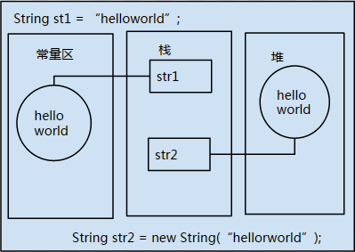
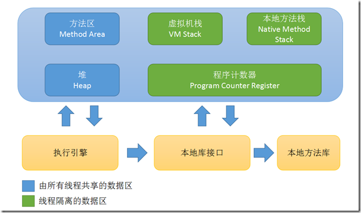
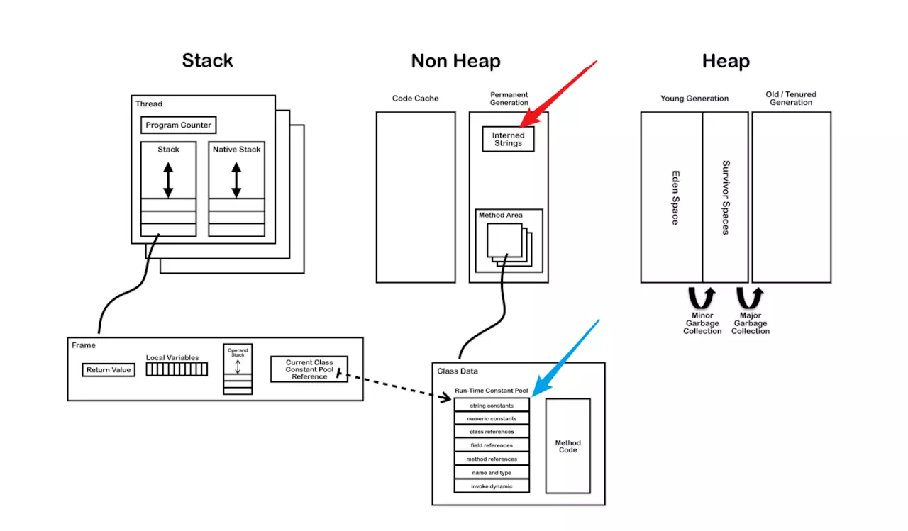
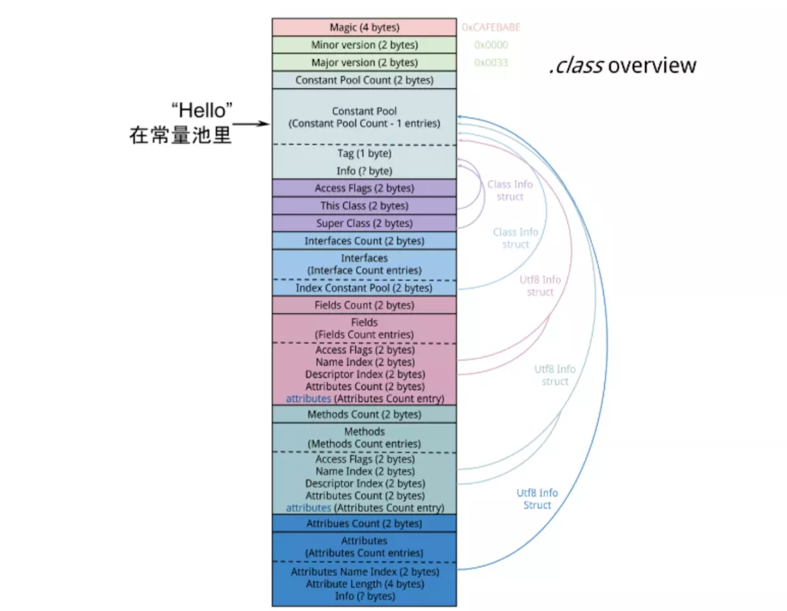

# String 相关

##  String 为什么是不可变的

## 怎么改变不可变的 String 的值

## 怎么向 Set 中存入相同的字符串

## 在循环中拼接字符串的正确操作方式

## 1. String类

字符串操作在编程中我们会大量使用,所以掌握字符串相关类对我们来说很重要.
Java为我们提供了 3 种操作字符串的类.由于 `String` 类的特殊,有必要了解一下Java运行时内存的概念,才能更好的理解字符串相关类的底层操作.

## Java中内存知识

在反射中我们学到,对于每一个被JVM加载到内存中的类,都会在方法区保存一份这个类的信息;
包括:

- 类的基本信息
	- 类的全名,直接父类的全民
	- 该类的接口
	- 该类的访问修饰符
- 类的详细信息
	-  运行时常量池  --> 字符串,常量,类名和方法名常量.
	-  字段信息  --> 字段名,类型,修饰符
	-  方法信息  --> 方法名,返回值类型,参数类型,修饰符,异常,方法的字节码
	-  静态变量  --> 在方法区中的静态区保存被类的所有实例共享的变量和静态快
	-  到类classloader的引用
	-  到类class的引用   JVM为每一个被加载到内存的类型创建一个class实例,用实例代表这个被加载的类

由此引出反射的概念:
在加载类的时候,加入方法区的所有信息,最后都会影城Class类的实例,代表这个被加载的类.方法去中的所有信息,都是可以通过这个Class类对象反射得到.

### Java运行时数据区的划分

- 程序计数器(Program Counter Register)
- 本地方法栈 (Native Method Stacks)
- Java虚拟机栈 (Java Visual Machine Stacks)
	- 局部变量,引用名等保存在栈中
	- 不共享,每个线程会有属于自己的栈
- Java堆 (Java Heap)
	- 被`new` 关键字所创建出来的所有实例对象
	- 被各个线程共享
- 方法区 (Method Area)
	- 被各个线程共享
	- 存储类信息,常量,静态变量,以及编译后的代码等数据

## String类

### String类的声明

`public final class String extends Object implements Serializable, Comparable<String>, CharSequence`
String类声明中,是被final修饰,所以可以看出字符串的内容是不可变的,而且是不能被继承的类;一旦一个String对象被创建,包含在这个对象中的内容是不可改变的,直至这个对象被回收;
其实String类在底层就是通过字符数组来实现的,对于数组,我们知道它的长度不可变,自然而然的String类也不可变了.

### String类在内存中的表现形式

1. 隐式创建
`String str1 = "helloworld";`
	- 在栈中声明一个str1的引用,然后在**常量区**中查找是否有"helloworld"这个常量;
		- 如果有,则直接返回一个引用给str1;
		- 如果没有,则先在常量区中创建 'helloworld"字符串,然后返回引用;
2. 显式创建
`String str2 = new String("张三");`
	- 在栈中声明一个str2的引用,然后在**堆**中创建一个字符串对象,里面的值是"张三";
	- 返回这个对象的引用;
	
然后我们可以通过 对象调用String类的方法,但是问题来了, `"helloworld".toCharArray()` 这句代码不会报错,说明`"helloworld"`可以当一个对象来使用,那么堆中的`"helloworld"`和常量池中的`"helloworld"`是什么关系呢?
那就让我们来说说他们2个之间不得不说的故事.

```java
// helloworld在常量区中
String str1 = "helloworld";
// 对象在堆中
String str2 = new String("helloworld");
```



对于上面2行代码,会在不同的区域创建2个对象.

- 执行第一行时,
	- 在栈中声明一个str1的引用,然后在**常量区**中查找是否有"helloworld"这个常量;
		- 如果有,则直接返回一个引用给str1;
		- 如果没有,则先在常量区中创建 'helloworld"字符串,然后返回引用;
- 执行第二行时,会在堆中创建一个字符串对象,这个对象的值为`"helloworld"`,然后再去常量区参看是否有`"helloworld"`这个常量字符串;
	- 如果没有,就在常量区创建一个`"helloworld"`字符串常量,然后与这个对象关联;
	- 如果有,则把常量区的`"helloworld"`引用同堆中对象关联起来;

无论如何,只要用new关键字实例化一个个字符串对象,都会在堆中创建实例,而隐式创建的话则不一定新建一个字符串常量;

那么问题来了
`String str2 = new String("helloworld");`会在内存中创建几个对象,几个引用?
答案是3个对象,2个引用;

- 对象 
	- String这个类的对象(反射机制)
	- String实例化对象 (堆中)
	- 常量区中的字符串对象
- 引用
	- 堆中字符串对象的引用
	- 常量区中字符串的引用

我们可以通过String类的intern()方法来实验一下
当调用 intern 方法时，如果常量池中已经包含一个等于此 String 对象的字符串(用 equals(Object) 方法确定)，则返回池中的字符串。否则，将此 String 对象添加到池中，并返回此 String 对象的引用

```java
public static void main (String[] args) {
    String s1 = "osEye.net";
    String s2 = new String ("osEye.net");
    if (s1 == s2) {
        System.out.println ("字符串引用s1和字符串引用s2所指向的是同一个对象");
    } else {
        System.out.println ("字符串引用s1和字符串引用s2所指向的不是同一个对象");
        if (s1.intern() == s2.intern() ) {
            System.out.println ("字符串引用s1和字符串引用s2在字符串常量池中联系的是同一个对象");
        } else {
            System.out.println ("字符串引用s1和字符串引用s2在字符串常量池中联系的不是同一个对象");
        }
    }
}
```
>输出
>字符串引用s1和字符串引用s2所指向的不是同一个对象
>字符串引用s1和字符串引用s2在字符串常量池中联系的是同一个对象

这种机制很好的实现了共享和节省内存空间,当我需要使用字符串时,如果内存中有这个字符串了,就不会再创建,而是直接返回已存在的字符串的引用.

对于
`String s = "hello" + "world"` 的分析
在JDK1.5之前,这条语句会生成2个字符串常量,
但是在JDK1.5之后,编译器对此做出了优化,最终只有一个字符串常量"helloworld"存入常量区中.
这种优化就是默认的调用了StringBuilder.append()方法;

### String类的使用
介绍几个常用的字符串操作的方法

- `charAt(int index)`  返回指定索引处的 char 值。
- `equals(Object anObject)` 将此字符串与指定的对象比较。
- `equalsIgnoreCase(String anotherString)`  将此 String 与另一个 String 比较，不考虑大小写
- `indexOf(int ch)`  返回指定字符在此字符串中第一次出现处的索引。
- `length()` 返回此字符串的长度。
- `matches(String regex)` 告知此字符串是否匹配给定的正则表达式。
- `replace(char oldChar, char newChar)` 返回一个新的字符串，它是通过用 newChar 替换此字符串中出现的所有 oldChar 得到的。
- `split(String regex)`  根据给定正则表达式的匹配拆分此字符串。
- `substring(int beginIndex)` 返回一个新的字符串，它是此字符串的一个子字符串。
- `trim()` 返回字符串的副本，忽略前导空白和尾部空白。
- `toCharArray()` 将此字符串转换为一个新的字符数组。

判断是否为空字符串
s != null && s != "";
**注意**判断不能为空必须放在前面,因为可能会报空指针异常

---------

## StringBuffer 类

- 为了能让String里面的内容能够改变,所以用StringBuffer类封装了String类;
- 使用append()方法向字符串末尾添加字符串,
- 线程安全的,效率比String高
- 经常使用在字符串拼接的地方,比如说数据库语句

## StringBuilder 类

### 与StringBuffer类的对比

```java
//StringBuilder类的append()方法
public synchronized StringBuffer append(String str){
	super.append(str);
	return this;
}

//StringBuffer类的append()方法
public StringBuffer append(String str){
	super.append(str);
	return this;
}
```
StringBuffer是线程不安全的,效率比StringBuffer高,在不考虑线程安全的时候优先考虑使用StringBuffer.

## 3种字符串对比

- 异同点
	- 都是 `final` 类,都不允许被继承;
	- `String` 长度不可改变,其他2种长度可变;
	- `StringBuffer` 是线程安全的,但是效率低, `StringBuilder` 线程不安全但是效率高
	- 性能: `StringBuilder > StringBuffer > String`

- 使用策略
	- 基本原则:
		- 如果操作少量的数据,用 `String` ;
		- 单线程操作大量数据,使用 `StringBuilder` ;
		- 多线程操作大量数据,使用 `StringBuffer` ;
	- 不建议使用 `String` 类的 "+" 进行频繁的字符串拼接,而是使用 `StringBuilder` 或者 `StringBuffer` 类;
	- `StringBuilder` 一般使用在方法内部来完成类似"+"功能,因为线程不安全,用完后丢弃;
	- `StringBuffer` 主要用在全局变量中;
	- 相同情况下使用  `StirngBuilder`  相比使用 ` StringBuffer`  仅能获得 10%~15% 左右的性能提升，但却要冒多线程不安全的风险。而在现实的模块化编程中，负责某一模块的程序员不一定能清晰地判断该模块是否会放入多线程的环境中运行，因此：除非确定系统的瓶颈是在  `StringBuffer`  上，并且确定你的模块不会运行在多线程模式下，才可以采用 `StringBuilder` ;否则还是用 `StringBuffer` 。

# 在Java虚拟机中，字符串常量到底存放在哪

## 前言

前阵子和朋友讨论一个问题： 字符串常量归常量池管理，那比如 String str = "abc"; "abc"这个对象是放在内存中的哪个位置，是字符串常量池中还是堆？

”这句代码的abc当然在常量池中，只有new String("abc")这个对象才在堆中创建“，他们大概是这么回答。

“abc”这个东西，是放在常量池中，这个答案是错误的。

**字符串“abc"的本体、实例，应该是存在于Java堆中。**

可能还真的有部分同学对这个知识点不熟悉，今天和大家聊聊字符串这个问题 ~

初学Java时，学到字符串这一部分，有一段代码

```java
String str1 = "hello";
String str2 = new String("hello"); 
```

> 书上的解释是：执行第一行的时候，已经把"hello"字符串放到了常量池中，执行第二行代码时，会将常量池中已经存在的"hello"复制一份到堆内存中，创建一个的新的String对象。虽然值一样，但他们是不同的对象。

当时看完这个解释，我产生了很多疑惑。因为在此之前已经知道字符串的底层是char数组实现的。我很疑惑：

* 他copy一份过去，是copy了char数组呢？
* 还是copy整个String对象？
* "hello" 这个对象实例真的存放在常量池中吗？

当时在网上搜了一些文章和答案，各有说辞，大部分回答都是 "str" 这个对象在常量池中，但也有认为字符串常量实例(或叫对象)是在堆中创建，只是将其引用放到字符串常量池中，交给常量池管理。

## JAVA内存区域 — 运行时数据区

理清这个问题前，需要梳理一下前置知识。

从一个经典的示意图讲起，以hotspot虚拟机为例，此内存模型需建立在JDK1.7之前的版本来讨论，JDK1.7之后有所改变，但是原理还是一样的。



Java虚拟机管理的内存是运行时数据区那一部分，简单概括一下其中各个区域的区别：

* **虚拟机栈**：线程私有，生命周期与线程相同，即每条线程都一个独立的栈(VM Stack)。每个方法执行时都会创建一个栈帧，也就是说，当有一条线程执行了多个方法时，就会有一个栈，栈中有多个栈帧。

* **本地方法栈**：线程私有

* **程序计数器**：线程私有

* **堆Heap**：线程共享，是Java虚拟机所管理的内存中最大的一块，在虚拟机启动时创建。此内存区域的唯一目的就是存放对象实例，几乎所有的对象实例都在这里分配内存。**在Java虚拟机规范中的描述是：所有的对象实例以及数组都要在堆上分配。 ** *(原文：The heap is the runtime data area from which memory for all class instances and arrays is allocated)*但有特殊情况，随着JIT编译器的发展，逃逸分析和标量替换技术的逐渐成熟，对象也可以在**栈上**分配。另外，虽说堆是线程共享，但其中也可以划分出多个线程私有的分配缓冲区*(Thread Local Allocation Buffer，TLAB)*。

* **方法区**：线程共享，它用于存储已被虚拟机加载的类信息、常量、静态变量、即时编译器编译后的代码等数据。

## JAVA的三种常量池

此外，Java有三种常量池，即**字符串常量池(又叫全局字符串池)、class文件常量池、运行时常量池**。



**1. 字符串常量池(也叫全局字符串池、string pool、string literal pool)**

字符串常量池在每个VM中只有一份，他在内存中的位置如图，红色箭头所指向的区域 Interned Strings

**2. 运行时常量池(runtime constant pool)**

当程序运行到某个类时，class文件中的信息就会被解析到内存的方法区里的运行时常量池中。看图可清晰感知到每一个类被加载进来都会产生一个**运行时常量池**，由此可知，每个类都有一个运行时常量池。它在内存中的位置如图，蓝色箭头所指向的区域，方法区中的Class Date中的运行时常量池(Run-Time Constant Pool)



**3. class文件常量池(class constant pool)**

class常量池是在编译后每个class文件都有的，class文件中除了包含类的版本、字段、方法、接口等描述信息外，还有一项信息就是 ***常量池****(constant pool table)*，用于存放编译器生成的各种字面量(Literal)和符号引用(Symbolic References)。*字面量就是我们所说的常量概念，如文本字符串、被声明为final的常量值等。*他在class文件中的位置如上图所示，Constant Pool 中。

## 个人理解

```java
public static void main(String[] args) {
	String str = "hello";
}
```

回到一开始说到的这句代码，可以来总结一下它的执行过程了。

1. 首先，字面量 "hello" 在编译期，就会被记录在 class文件的 **class常量池**中。
2. 而当 class文件被加载到内存中后，JVM就会将 class常量池中的**大部分内容存放到运行时常量池**中，但是**字符串 "hello" 的本体**(对象)和其他所有对象一样，是**会在堆中创建**，**再将引用放到字符串常量池**，也就是图一的 Interned Strings的位置。(RednaxelaFX 的文章里，测试结果是在新生代的Eden区。但因为一直有一个引用驻留在字符串常量池，所以不会被GC清理掉)
3. 而到了String str = "hello" 这步，JVM会去字符串常量池中找，如果找到了，JVM会在栈中的局部变量表里创建str变量，然后把字符串常量池中的(hello 对象的)**引用**复制给 str 变量。

在《深入理解Java虚拟机》这本书中也有字符串相关的解释，举其中几个例子：

**例子1**

> (原文)运行时常量池(Runtime Constant Pool)是方法区的一部分。Class文件中除了有类的版本、字段、方法、接口等描述信息外，还有一项信息是常量池(Constant Pool Table)，用于存放编译期生成的各种字面量和符号引用，**这部分内容将在类加载后进入方法区的运行时常量池中存放。**

最后一句描述不太准确，编译期生成的各种字面量并不是全部进入方法区的运行时常量池中。**字符串字面量就不进入运行时常量池**，而是**在堆中创建了对象**，**再将引用驻留到字符串常量池中。**

**例子2**

```java
//代码清单2-7&emsp;String.intern()返回引用的测试

public class RuntimeConstantPoolOOM{

	public static void main(String[]args){
		String str1=new StringBuilder("计算机").append("软件").toString();
		System.out.println(str1.intern()==str1);
		String str2=new StringBuilder("ja").append("va").toString();
		System.out.println(str2.intern()==str2);
	}
}
```

::: tip 原文
这段代码在JDK 1.6中运行，会得到两个false，而在JDK 1.7中运行，会得到一个true和一个false。
产生差异的原因是: 在JDK 1.6中，intern()方法会把首次遇到的字符串实例复制到永久代中，返回的也是永久代中这个字符串实例的引用，而由StringBuilder创建的字符串实例在Java堆上，所以必然不是同一个引用，将返回false。而JDK 1.7(以及部分其他虚拟机，例如JRockit)的intern()实现不会再复制实例，只是在常量池中记录首次出现的实例引用，因此intern()返回的引用和由StringBuilder创建的那个字符串实例是同一个。对str2比较返回false是因为 “java” 这个字符串在执行StringBuilder.toString()之前已经出现过，字符串常量池中已经有它的引用了，不符合“首次出现”的原则，而“计算机软件”这个字符串则是首次出现的，因此返回true。
:::

原文解释也不太准确，我觉得在 JDK 1.6中，intern()并不会把首次遇到的字符串实例复制到永久代中，而是会将实例再复制一份到堆(heap)中，然后将其引用放入字符串常量池中进行管理，所以此代码返回false。而JDK1.7中的intern()不会再复制实例，直接将首次遇到的此字符串实例的引用，放入字符串常量池，于是返回true。关于此观点，还没看到大神文章实锤，欢迎讨论。

最后再延伸一点，大家都知道，字符串的value是final修饰的char数组，那么以下这段代码：

```java
// private final char value[];
String str1 = "hello world";
String str2 = new String("hello world");
String str3 = new String("hello world");
```

str1、str2、str3 三个变量所指向的都是不同的对象。(str1 != str2 != str3)

那么，这三个对象里的char数组是否是同一个数组？相信大家都有答案了。

* * *

此文所讨论的Java内存模型是建立在JDK1.7之前。JDK 7开始 Hotspot 虚拟机把字符串常量池(Interned String位置)从永久代(PermGen)挪到Heap堆，JDK 8又彻底取消 PermGen，把诸如class之类的元数据都挪到GC堆之外管理。但不管怎样，基本原理还是不变的，字面量 ”hello“ 等依旧不是放在 Interned String 中。

* * *

**推荐文章：**

* [请别再拿 “String s = new String("xyz"); 创建了多少个String实例” 来面试了吧](https://link.juejin.im/?target=https%3A%2F%2Frednaxelafx.iteye.com%2Fblog%2F774673)
* [借HSDB来探索HotSpot VM的运行时数据](https://link.juejin.im/?target=https%3A%2F%2Frednaxelafx.iteye.com%2Fblog%2F1847971) *作者：RednaxelaFX，曾为《深入理解Java虚拟机》提推荐语*
* [java用这样的方式生成字符串：String str = "Hello"，到底有没有在堆中创建对象？](https://link.juejin.im/?target=https%3A%2F%2Fwww.zhihu.com%2Fquestion%2F29884421%2Fanswer%2F113785601) - 胖君的回答 - 知乎

