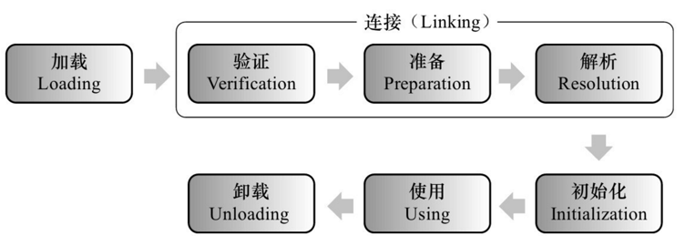

# JVM 相关面试题 

→ JVM 内存结构
class 文件格式、运行时数据区:堆、栈、方法区、直接内存、运行时常量池、

堆和栈区别

Java 中的对象一定在堆上分配吗？


→ Java 内存模型
计算机内存模型、缓存一致性、MESI 协议

可见性、原子性、顺序性、happens-before、

内存屏障、synchronized、volatile、final、锁

→ 垃圾回收
GC 算法:标记清除、引用计数、复制、标记压缩、分代回收、增量式回收

GC 参数、对象存活的判定、垃圾收集器（CMS、G1、ZGC、Epsilon）

→ JVM 参数及调优
-Xmx、-Xmn、-Xms、Xss、-XX:SurvivorRatio、

-XX:PermSize、-XX:MaxPermSize、-XX:MaxTenuringThreshold

→ Java 对象模型
oop-klass、对象头

→ HotSpot
即时编译器、编译优化

→ 虚拟机性能监控与故障处理工具
jps, jstack, jmap, jstat, jconsole, jinfo, jhat, javap, btrace, TProfiler

Arthas

类加载机制


classLoader、类加载过程、双亲委派（破坏双亲委派）、模块化（jboss modules、osgi、jigsaw）

编译与反编译


什么是编译（前端编译、后端编译）、什么是反编译

JIT、JIT 优化（逃逸分析、栈上分配、标量替换、锁优化）

编译工具:javac

反编译工具:javap 、jad 、CRF

Java 底层知识
→ 字节码、class 文件格式
→ CPU 缓存, L1, L2, L3 和伪共享
→ 尾递归
→ 位运算
用位运算实现加、减、乘、除、取余

## 1. Java GC是在什么时候, 对什么东西, 做了什么事情？
地球人都知道, Java有个东西叫垃圾收集器, 它让创建的对象不需要像c/cpp那样delete、free掉, 你能不能谈谈, GC是在什么时候, 对什么东西, 做了什么事情？

**一.回答:什么时候?**
1.**系统空闲的时候**.
  分析:这种回答大约占30%, 遇到的话一般我就会准备转向别的话题, 譬如算法、譬如SSH看看能否发掘一些他擅长的其他方面.
2.**系统自身决定, 不可预测的时间/调用System.gc()的时候.**
  分析:这种回答大约占55%, 大部分应届生都能回答到这个答案, 起码不能算错误是吧, 后续应当细分一下到底是语言表述导致答案太笼统, 还是本身就只有这样一个模糊的认识.
3.**能说出新生代、老年代结构, 能提出minor gc/full gc**
  分析:到了这个层次, 基本上能说对GC运作有概念上的了解, 譬如看过《深入JVM虚拟机》之类的.这部分不足10%.
4.**能说明minor gc/full gc的触发条件、OOM的触发条件, 降低GC的调优的策略**.

> 分析:列举一些我期望的回答:eden满了minor gc, 升到老年代的对象大于老年代剩余空间full gc, 或者小于时被HandlePromotionFailure参数强制full gc；gc与非gc时间耗时超过了GCTimeRatio（GC时间占总时间的比率, 默认值为99, 即允许1%的GC时间, 仅在使用Parallel Scavenge收集器时生效）的限制引发OOM, 调优诸如通过NewRatio控制新生代老年代比例, 通过MaxTenuringThreshold控制进入老年前生存次数等……能回答道这个阶段就会给我带来比较高的期望了, 当然面试的时候正常人都不会记得每个参数的拼写, 我自己写这段话的时候也是翻过手册的.回答道这部分的小于2%.
总结:程序员不能具体控制时间, 系统在不可预测的时间调用System.gc()函数的时候；当然可以通过调优, 用NewRatio控制newObject和oldObject的比例, 用MaxTenuringThreshold 控制进入oldObject的次数, 使得oldObject 存储空间延迟达到full gc,从而使得计时器引发gc时间延迟OOM的时间延迟, 以延长对象生存期.

**二.回答:对什么东西？**
1. 不使用的对象.
  分析:相当于没有回答, 问题就是在问什么对象才是“不使用的对象”.大约占30%.
2 .超出作用域的对象/引用计数为空的对象.
  分析:这2个回答站了60%, 相当高的比例, 估计学校教java的时候老师就是这样教的.第一个回答没有解决我的疑问, gc到底怎么判断哪些对象在不在作用域的？至于引用计数来判断对象是否可收集的, 我可以会补充一个下面这个例子让面试者分析一下
3. **从gc root开始搜索, 搜索不到的对象.**
  分析:根对象查找、标记已经算是不错了, 小于5%的人可以回答道这步, 估计是引用计数的方式太“深入民心”了.基本可以得到这个问题全部分数.
  PS:有面试者在这个问补充强引用（类似new Object(), 只要强引用还在就不会被回收）、弱引用（还有用但并非必须的对象, 在系统将要发生OOM之前, 才会将这些对象回收）、软引用（只能生存到下一次垃圾收集之前）、幻影引用（无法通过幻影引用得到对象, 和对象的生命周期无关, 唯一目的就是能在这个对象被回收时收到一个系统通知）区别等, 不是我想问的答案, 但可以加分.
4. 从root搜索不到, 而且经过第一次标记、清理后, 仍然没有复活的对象.
  分析:我期待的答案.但是的确很少面试者会回答到这一点, 所以在我心中回答道第3点我就给全部分数. 
>总结:超出了作用域或引用计数为空的对象；从gc root开始搜索找不到的对象, 而且经过一次标记、清理, 仍然没有复活的对象.

**三.回答:做什么？**
1. 删除不使用的对象, 腾出内存空间.
  分析:同问题2第一点.40%.
2. 补充一些诸如停止其他线程执行、运行finalize等的说明.
  分析:起码把问题具体化了一些, 如果像答案1那样我很难在回答中找到话题继续展开, 大约占40%的人.
3. 能说出诸如新生代做的是复制清理、from survivor、to survivor是干啥用的、老年代做的是标记清理、标记清理后碎片要不要整理、复制清理和标记清理有有什么优劣势等.
  分析:也是看过《深入JVM虚拟机》的基本都能回答道这个程度, 其实到这个程度我已经比较期待了.同样小于10%.
4. 除了3外, 还能讲清楚串行、并行（整理/不整理碎片）、CMS等搜集器可作用的年代、特点、优劣势, 并且能说明控制/调整收集器选择的方式.
分析:同上面2个问题的第四点. 
>总结:删除不使用的对象, 回收内存空间；运行默认的finalize, JVM用from survivor、to survivor对它进行标记清理, 对象序列化后也可以使它复活.
  
  
## 10. 类的加载机制



类初始化时机:只有当对类的主动使用的时候才会导致类的初始化, 类的主动使用包括以下六种:

- 创建类的实例, 也就是new的方式
- 访问某个类或接口的静态变量, 或者对该静态变量赋值
- 调用类的静态方法
- 反射(如Class.forName(“com.shengsiyuan.Test”))
- 初始化某个类的子类, 则其父类也会被初始化
- Java虚拟机启动时被标明为启动类的类(Java Test), 直接使用java.exe命令来运行某个主类

在如下几种情况下, Java虚拟机将结束生命周期

- 执行了System.exit()方法
- 程序正常执行结束
- 程序在执行过程中遇到了异常或错误而异常终止
- 由于操作系统出现错误而导致Java虚拟机进程终止


**启动类加载器:**
Bootstrap ClassLoader, 负责加载存放在JDK\jre\lib(JDK代表JDK的安装目录, 下同)下, 或被-Xbootclasspath参数指定的路径中的, 并且能被虚拟机识别的类库(如rt.jar, 所有的java.*开头的类均被Bootstrap ClassLoader加载).启动类加载器是无法被Java程序直接引用的.

**扩展类加载器:**
Extension ClassLoader, 该加载器由sun.misc.Launcher$ExtClassLoader实现, 它负责加载JDK\jre\lib\ext目录中, 或者由java.ext.dirs系统变量指定的路径中的所有类库(如javax.*开头的类), 开发者可以直接使用扩展类加载器.

**应用程序类加载器:**
Application ClassLoader, 该类加载器由sun.misc.Launcher$AppClassLoader来实现, 它负责加载用户类路径(ClassPath)所指定的类, 开发者可以直接使用该类加载器, 如果应用程序中没有自定义过自己的类加载器, 一般情况下这个就是程序中默认的类加载器.

### [双亲委派模型](../java/jvm/parents_dlegation_mode.md)

::: tip 双亲委派模型的工作流程
如果一个类加载器收到了类加载的请求, 它首先不会自己去尝试加载这个类, 而是把请求委托给父加载器去完成, 依次向上, 因此, 所有的类加载请求最终都应该被传递到顶层的启动类加载器中, 只有当父加载器在它的搜索范围中没有找到所需的类时, 即无法完成该加载, 子加载器才会尝试自己去加载该类.
:::

**双亲委派机制:**

1. 当AppClassLoader加载一个class时, 它首先不会自己去尝试加载这个类, 而是把类加载请求委派给父类加载器ExtClassLoader去完成.
2. 当ExtClassLoader加载一个class时, 它首先也不会自己去尝试加载这个类, 而是把类加载请求委派给BootStrapClassLoader去完成.
3. 如果BootStrapClassLoader加载失败(例如在$JAVA_HOME/jre/lib里未查找到该class), 会使用ExtClassLoader来尝试加载；
4. 若ExtClassLoader也加载失败, 则会使用AppClassLoader来加载, 如果AppClassLoader也加载失败, 则会报出异常ClassNotFoundException.

```java
public Class<?> loadClass(String name)throws ClassNotFoundException {
          return loadClass(name, false);
}

protected synchronized Class<?> loadClass(String name, boolean resolve)throws ClassNotFoundException {
// 首先判断该类型是否已经被加载
Class c = findLoadedClass(name);
if (c == null) {
    //如果没有被加载, 就委托给父类加载或者委派给启动类加载器加载
    try {
        if (parent != null) {
             //如果存在父类加载器, 就委派给父类加载器加载
            c = parent.loadClass(name, false);
        } else {
        //如果不存在父类加载器, 就检查是否是由启动类加载器加载的类, 通过调用本地方法native Class findBootstrapClass(String name)
            c = findBootstrapClass0(name);
        }
    } catch (ClassNotFoundException e) {
     // 如果父类加载器和启动类加载器都不能完成加载任务, 才调用自身的加载功能
        c = findClass(name);
    }
}
if (resolve) {
    resolveClass(c);
}
return c;
}
```

**双亲委派模型意义:**

- 系统类防止内存中出现多份同样的字节码
- 保证Java程序安全稳定运行

**自定义加载器**

```java
package com.neo.classloader;
import java.io.*;

public class MyClassLoader extends ClassLoader {
  private String root;
  protected Class<?> findClass(String name) throws ClassNotFoundException {
      byte[] classData = loadClassData(name);
      if (classData == null) {
          throw new ClassNotFoundException();
      } else {
          return defineClass(name, classData, 0, classData.length);
      }
  }

  private byte[] loadClassData(String className) {
      String fileName = root + File.separatorChar
              + className.replace('.', File.separatorChar) + ".class";
      try {
          InputStream ins = new FileInputStream(fileName);
          ByteArrayOutputStream baos = new ByteArrayOutputStream();
          int bufferSize = 1024;
          byte[] buffer = new byte[bufferSize];
          int length = 0;
          while ((length = ins.read(buffer)) != -1) {
              baos.write(buffer, 0, length);
          }
          return baos.toByteArray();
      } catch (IOException e) {
          e.printStackTrace();
      }
      return null;
  }
  public String getRoot() {
      return root;
  }
  public void setRoot(String root) {
      this.root = root;
  }
  public static void main(String[] args)  {
      MyClassLoader classLoader = new MyClassLoader();
      classLoader.setRoot("E:\\temp");
      Class<?> testClass = null;
      try {
          testClass = classLoader.loadClass("com.neo.classloader.Test2");
          Object object = testClass.newInstance();
          System.out.println(object.getClass().getClassLoader());
      } catch (ClassNotFoundException e) {
          e.printStackTrace();
      } catch (InstantiationException e) {
          e.printStackTrace();
      } catch (IllegalAccessException e) {
          e.printStackTrace();
      }
  }
}
```

## 28. 数据库驱动为什么要使用 Class.forName()

在Java开发特别是数据库开发中, 经常会用到Class.forName( )这个方法.通过查询Java Documentation我们会发现使用Class.forName( )静态方法的目的是为了动态加载类.在加载完成后, 一般还要调用Class下的newInstance( )静态方法来实例化对象以便操作.

因此, 单单使用Class.forName( )是动态加载类是没有用的, 其最终目的是为了实例化对象.
Class.forName("")返回的是类
Class.forName("").newInstance()返回的是object

刚才提到, Class.forName("");的作用是要求JVM查找并加载指定的类, 如果在类中有静态初始化器的话, JVM必然会执行该类的静态代码段.
而在JDBC规范中明确要求这个Driver类必须向DriverManager注册自己, 即任何一个JDBC Driver的 Driver类的代码都必须类似如下:

```java
public class MyJDBCDriver implements Driver {
    static {
        DriverManager.registerDriver(new MyJDBCDriver());
        }
}
```

既然在静态初始化器的中已经进行了注册, 所以我们在使用JDBC时只需要Class.forName(XXX.XXX);就可以了.

```
we just want to load the driver to jvm only, 
but not need to user the instance of driver, 
so call Class.forName(xxx.xx.xx) is enough, 
if you call Class.forName(xxx.xx.xx).newInstance(), 
the result will same as calling Class.forName(xxx.xx.xx), 
because Class.forName(xxx.xx.xx).newInstance() will load driver first, 
and then create instance, but the instacne you will never use in usual,
so you need not to create it.
```

总结:jdbc数据库驱动程序最终的目的, 是为了程序员能拿到数据库连接, 而进行jdbc规范的数据库操作.拿到连接的过程是不需要你自己来实例化驱动程序的, 而是通过 DriverManger.getConnection(string str); .因此一般情况下, 对于程序员来说, 除非特别需求, 是不会自己去实例化一个数据库驱动使用里面的方法的.

## static 和 final 修改的成员变量的加载时机


## 字符串池、常量池（运行时常量池、Class 常量池）、intern